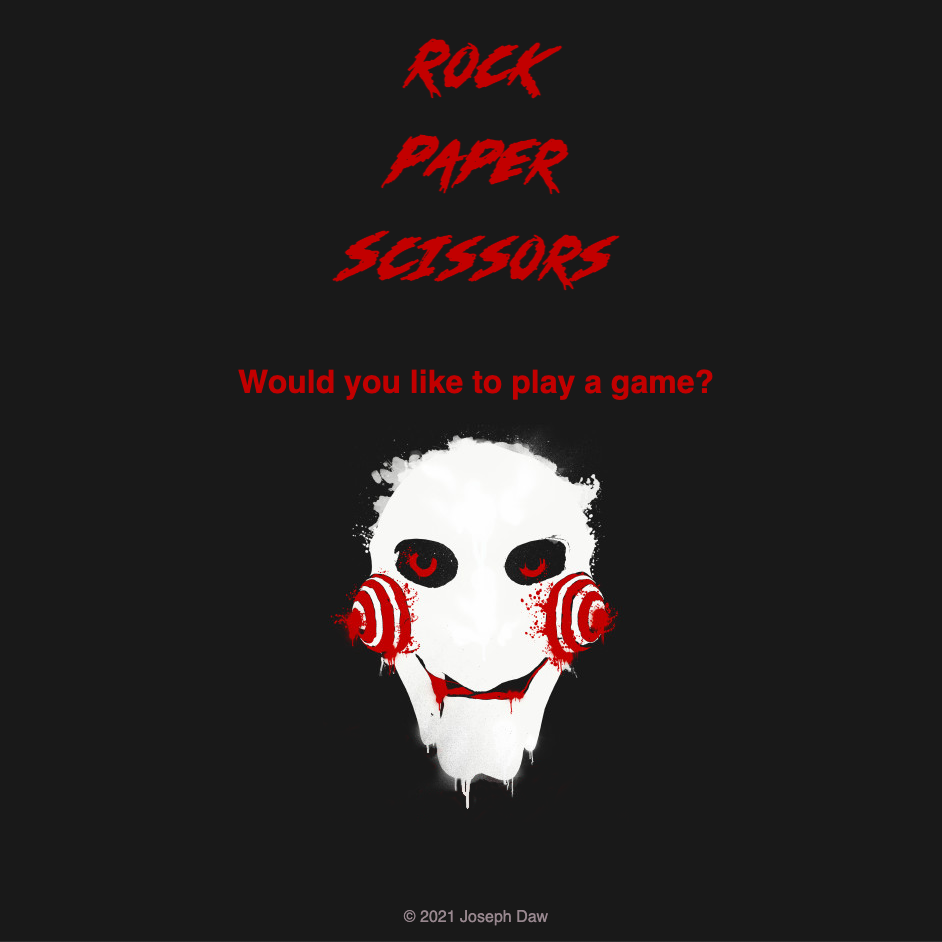

# Rock, Paper, Scissors

## Description
This website is a responsive HTML website using semantic tags, CSS, and JavaScript. I designed the site using a "mobile first" philosophy and have tried to make it fit without scrolling on as many screen sizes as possible.

When the user clicks on the face, they are given a series of prompts in order to play the game. Once the game has finished the score count is displayed and the user has the option to play again.

You can [view this site](https://josephdaw.github.io/rock-paper-scissors) on Github Pages at https://josephdaw.github.io/rock-paper-scissors.

## Lessons
As this site doesn't have much to it, I wanted it to display without scrolling as much as possible. This created the issue of how to make sure that the page was filled on larger screens. I used a [flexbox solution](https://stackoverflow.com/questions/16679146/force-footer-on-bottom-on-pages-with-little-content) to get the content to fill to the bottom of the page.

In this design I have also incorporated a custom font called ["No Mercy"](https://www.fontspace.com/no-mercy-font-f62831). This is the first time I have attempted to use a custom font. As I am used to linking a stylesheet to the index.html file, I used the same relative link thinking that browsers always start at the root and follow the link. It took me a little while (longer than I care to admit) to work out that I needed to have the link relative to the CSS file. Once I fixed that the font worked perfectly. I am very happy with the choice of font, I think it fits nicely with the theme I was trying for.

## Credits
- Heading Font ["No Mercy"](https://www.fontspace.com/no-mercy-font-f62831) by Jonathan S Harris.
- 'Saw Face' design by [The Shirt List](https://www.theshirtlist.com/lets-play-a-game-t-shirt-2/)

## License
This project is released under the [MIT License](LICENSE).